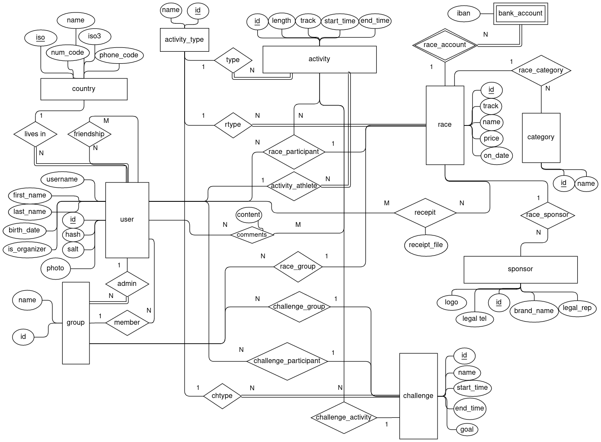
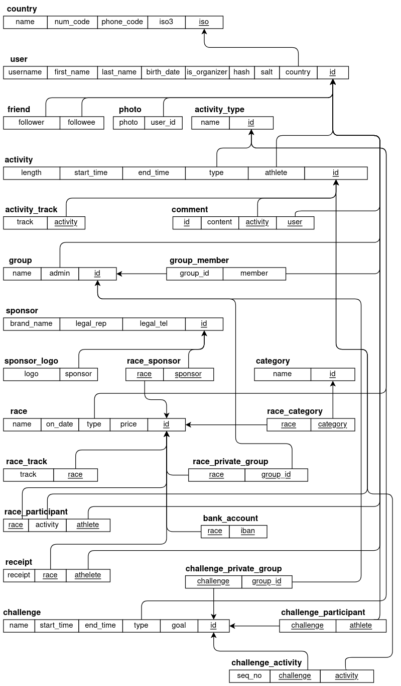
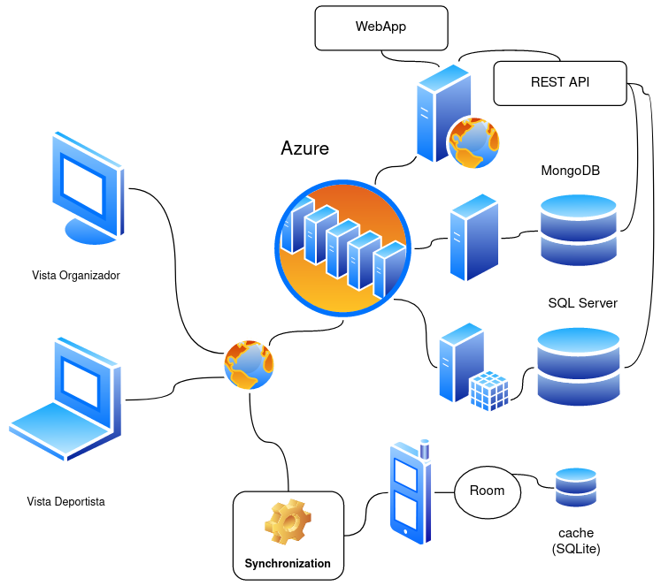

---
title:
  Instituto Tecnológico de Costa Rica\endgraf\bigskip \endgraf\bigskip\bigskip\
  Proyecto 1 - StraviaTEC \endgraf\bigskip\bigskip\bigskip\bigskip
author:
  - José Morales Vargas, carné 2019024270
  - Alejandro Soto Chacón, carné 2019008164
  - Ignacio Vargas Campos, carné 2019053776
  - José Retana Corrales, carné 2020144743
date: \bigskip\bigskip\bigskip\bigskip Área Académica de\endgraf Ingeniería en Computadores \endgraf\bigskip\bigskip\ Bases de Datos \endgraf  (CE3101) \endgraf\bigskip\bigskip Profesor Marco Rivera Meneses \endgraf\vfill  Semestre I 2022
header-includes:
  - \setlength\parindent{24pt}
  - \usepackage{url}
  - \usepackage{float}
  - \floatplacement{figure}{H}
lang: es-ES
papersize: letter
classoption: fleqn
geometry: margin=1in
fontsize: 12pt
fontfamily: sans
linestretch: 1.5
bibliography: bibliografia.bib
csl: ieee.csl
nocite: | 
  @microsoft-2022A, @microsoft-2022B, @microsoft-2020, @google-2021, @google-2022, @elmasri-2016, @unknown-author-2021, @android-room
...

\maketitle
\thispagestyle{empty}
\clearpage
\tableofcontents
\pagenumbering{roman}
\clearpage
\pagenumbering{arabic}
\setcounter{page}{1}

## Modelo conceptual

## Modelo relacional

{height=80%}

## Mapeo conceptual-relacional

### Mapeo de tipos de entidades fuertes

Se crean relaciones para las siguientes entidades fuertes:

| Nombre entidad | Pk          |
|:---------------|:-----------:|    
| `country`      | iso         |            
| `user`         | id          |    
| `group`        | id          |        
| `activity_type`| id          |                
| `activity`     | id          |                    
| `race`         | id          |        
| `challenge`    | id          |                
| `category`     | id          |  
| `sponsor`      | id          |  

Por buena práctica se separan los datos "pesados" en sus relaciones propias con 
llaves foráneas que referencian a las entidades a las que pertenecen, 
específicamente:

1. `photo`: Contiene el atributo `photo` de cada `user`.
1. `sponsor_logo`: Contiene el atributo `logo` de cada `sponsor`.
1. `activity_track`: Contiene el atributo `track` de cada `activity`.
1. `race_track`: Contiene el atributo `track` de cada `race`.

### Mapeo de tipos de entidades débiles

Solo se tiene una entidad débil: `bank_account`, relacionada a race por medio de 
la relación `race_account`. Esta se mapea a una relación de dos atributos:

- `race`: Referencia a entidad propietaria.
- `iban`: Llave parcial de la entidad débil.

### Mapeo de tipos de asociaciones binarias 1:1

No se encuentran este tipo de relaciones en el modelo de relacional.

### Mapeo de tipos de asociaciones binarias 1:N

Para las relaciones 1:N se decidió realizar el mapeo con un enfoque en evitar 
posibilidad de valores nulos. 

Se mapean como atributos de otras relaciones las siguientes relaciones que 
tienen participación absoluta del lado N:

1. `lives in` se mapea a un atributo FK `country` de la relación `user` que 
   referencia un `id` de `country`.
1. `type` se mapea a un atributo FK de `activity` llamado de igual manera. 
   Referencia un `id` de `type`.
1. `rtype` se mapea a un atributo FK de `race` llamado `type`. Referencia un 
   `id` de `type`.
1. `chtype` se mapea a un atributo FK de `challenge` llamado `type`. Referencia 
   un `id` de `type`.
1. `admin` se mapea a un atributo FK de `group` llamado `admin` que referencia 
   un `id` de un `user`.
1. `activity_athlete` se mapea a un atributo FK de `activity` llamado `athlete` 
   que referencia un `id` de user.

Se mapean como referencias cruzadas las relaciones que sí pueden presentar en 
algún momento valores nulos:

1. `race_group`: FKs a `race` y `group`.
1. `race_category`: FKs a `race` y `category`.
1. `race_sponsor`: FKs a `race` y `sponsor`.
1. `challenge_group`: FKs a `challenge` y `group`.
1. `challenge_participant`: FKs a `challenge` y `athlete`.
1. `challenge_activity`: FKs a `challenge` y `activity`.

### Mapeo de tipos de asociaciones binarias N:M

Estas relaciones de mapean a relaciones de referencias cruzadas.

1. `friendship`: Se mapea a una relación `friend` que contiene un atributo 
   `follower` y otro `followee` que referencian al atributo `id` de `user`. 
1. `receipt`: Se mapea a una relación `receipt` que contiene el atributo de la 
   relación `receipt_file` bajo el nombre de `receipt` y FKs que apuntan a las 
   PKs de `race` y `user`.

### Mapeo de atributos multivaluados

No se tienen atributos multivaluados para mapear. 

### Relación ternaria (caso especial)

La relación `race_participant` relaciona  `race`,  `user` y `activity`, sin 
embargo, la relación con la última entidad tiene una funcionalidad de registro 
de completitud, pero no es tan relevante para lo que esta relación expresa. Se 
mapea esta relación a una relación cruzada de las 3 entidades, donde la PK de la
relación es una combinación entre la referencia a `race` y a `user`.

## Estructuras de datos desarrolladas(Tablas)

## Descripción detallada de la arquitectura desarrollada

### Diagrama de arquitectura

El software desarrollado se puede separar en dos dominios: app móvil y software 
desplegado en la nube. Lo que se muestra como vistas en el diagrama de la figura
\ref{diag-arqui} son realmente consumidores de la app web que forma parte del 
dominio de software desplegado en la nube.

En en caso de la app móvil se puede notar lo siguiente:

- Se hace uso de SQLite para guardar datos persistentes en el dispositivo móvil.
- La interfaz entre la aplicación y SQLite se da por medio de la biblioteca Room.
- El dispositivo móvil se conecta a la red, pero antes de conectarse a la red 
  existe un nodo que indica la existencia de un proceso de sincronización 
  durante las interacciones con los recursos de la red.

En el dominio de software desplegado en la nube la arquitectura es un poco más 
compleja. Se puede notar que:

- Todo el software es parte del mismo conjunto de recursos desplegados en Azure.
- Se tiene la base de datos principal corriendo en su propio SQL Server.
- La base de datos NoSQL (MongoDB) se encuentra desplegada en una máquina virtual 
  propia (azure no tiene un servicio dedicado de MongoDB).
- Tanto la App Web como la REST API son desplegadas en el mismo Web Server. 

## Problemas conocidos

## Problemas encontrados

## Conclusiones

## Recomendaciones

## Bibliografía

::: {#refs}
:::

