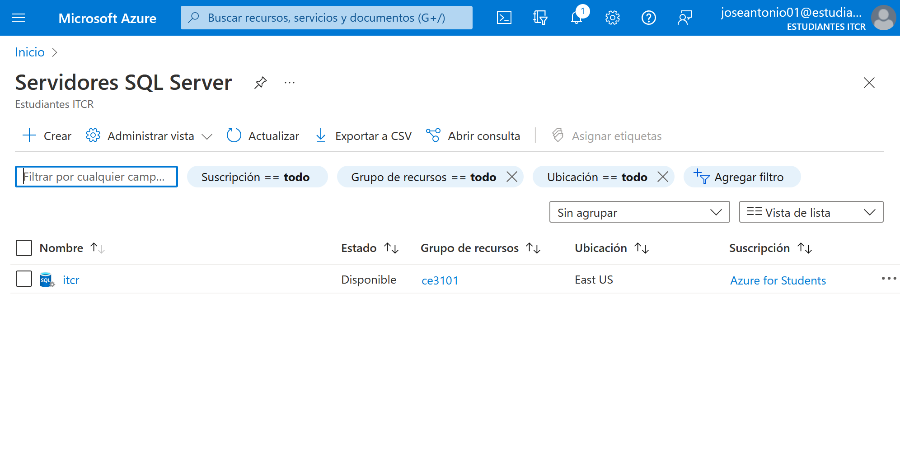
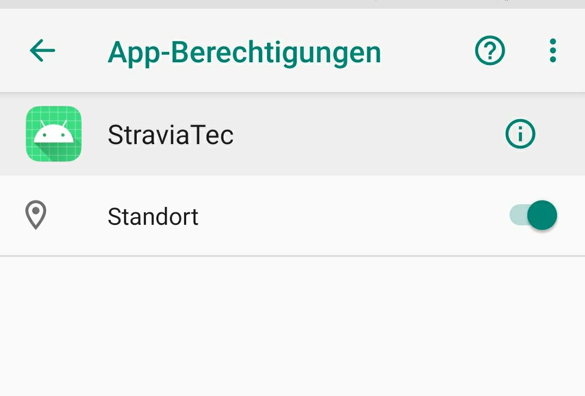

---
title:
  Instituto Tecnológico de Costa Rica\endgraf\bigskip \endgraf\bigskip\bigskip\
  StraviaTEC Documento de Instalación \endgraf\bigskip\bigskip\bigskip\bigskip
author:
  - José Morales Vargas, carné 2019024270
  - Alejandro Soto Chacón, carné 2019008164
  - Ignacio Vargas Campos, carné 2019053776
  - José Retana Corrales, carné 2020144743
date: \bigskip\bigskip\bigskip\bigskip Área Académica de\endgraf Ingeniería en Computadores \endgraf\bigskip\bigskip\ Bases de Datos \endgraf  (CE3101) \endgraf\bigskip\bigskip Profesor Marco Rivera Meneses \endgraf\vfill  Semestre I 2022
header-includes:
  - \setlength\parindent{24pt}
  - \usepackage{url}
  - \usepackage{float}
  - \floatplacement{figure}{H}
lang: es-ES
papersize: letter
classoption: fleqn
geometry: margin=1in
fontsize: 12pt
fontfamily: sans
linestretch: 1.5
...

\maketitle
\thispagestyle{empty}
\clearpage
\tableofcontents
\pagenumbering{roman}
\clearpage
\pagenumbering{arabic}
\setcounter{page}{1}


# Bases de datos, Servicio Web y App Web

Primeramente se debe realizar Login o se debe realizar la creación de cuenta de azure si es necesario, para así poder utilizar los servicios de Azure.

{height=50%}

Una vez regitrado, debe aparecer en la página principal de Azure, de donde se tendrá acceso a todos los serviciós necesarios para la creación de la base de datos, el servicio web y los demás recursos.

{height=50%}

## Grupo de Recursos

Para la creación del grupo de recursos, se debe buscar en la barra de búsqueda principal de Azure "Grupos de Recursos"y hacer click en este. Una vez hecho esto, se mostrará la página principal de los Grupos de Recursos, de donde se necesitará hacer click en el botón de crear.

Una vez hechoi esto, se me mostrrá la página de datos básicos, en el cual se debe escoger la suscripción de Azure a utilizar y especificar el nombre del grupo de recursos a crear. Seguidametne se hará click en siguiente.

{height=50%}

Seguidamente se mostrará la pantalla de Etiquetas, en la cual no se hará nada y solo se hace click en siguiente.

{height=50%}

Seguidamente se muestra la página de Revisar y Crear, en donde solo se tendrá que hacer click en el botón de crear, lo cuál lo llevará a la página del grupo de recurso recien creado.

## Servidor SQL

Seguidamente se hará el setup del servidor SQL, para el cual se irá a la barra de búsqueda principal de Azure, en el cual se buscará 

{height=50%}

Una vez entrado en la página de Servidores SQL Server, se deberá realizar click en el botón de "Crear".

{height=50%}

Seguidamente se le mostrará la página de información básica para la creación del servidor, en la cual se debe detallar el grupo de recursos ya creado anteriormente, el nuevo nombre del servidor y el nombre del inicio de sesión del administrador y su respectiva contraseña. Seguidamente se hace click en siguiente.

{height=50%}

En la página de "Redes", se debe dar click a "Sí" para permitire que los servicios y recursos de Azure accedan al servidor. Seguidamente se hace click en siguiente.

{height=50%}

En la página de Configuración adicional se debe deshabilitar Microsoft Defender para SQL, esto para ahorrar el dinero limitado de la cuenta intitucional. Seguidamente se hace click en siguiente.

{height=50%}

En la págiona de etiquetas no se debe especificar nada y solamente se ahce click en siguiente. Seguidamente haga click en siguiente. En la página de Revisr y crear solamente se debe hacer click en crear, lo cual terminará el proceso de creación del Servidor SQL.

{height=50%}

## Máquina Virtual

Seguidamente se hace el setup de la máquina virtual necesaria para correr MongoDB. Primeramente se debe buscar en el buscador principal de Azure "Máquinas Virtuales" y entrar a la página principal de estas, para hacer click en el botón de "Crear".

{height=50%}

Seguidamente se le mostrará la página de información básica de la máquina virutal, en la cual debe especificar el nombrte de la nueva máquina virtual, se debe seleccionar una región en la que se permita escoger un tamaño de máquina virtual (memoria y poder de procesamiento). En el caso del proyecto, se utilizó (Asia Pacific) Australia East. También se debe especificar en opciones de disponibiliadad que no se requiere redundancia de la infraestructura, seguidamente se escoge la imagen a utilizar (Windows Server 2022), se selecciona el tamaño de la máquina virtual (seleccionar región que le permita escoger uno, preferiblemente de precio bajo). Se deberá seguidamente determinar el nombre de usuario de la máquina virtual y su contraseña respectiva. En la reglas de puerto de entrada se debe establecer "Permitir los puertos Seleccionados" y escoger el puerto de entrada RDP (3389). También se debe seleccionar que se tiene una licencia de windows server existente y que se confirma que es válida. Seguidamente se hace click en siguiente.

{height=50%}

En la pagina de Discos, se debe especificar el tipo de disco del sistema operativo a utilizar (HDD Estándar) y hacer click en siguiente.

{height=50%}

En la página de redes no se debe hacer ningun cambio de lo que ya está especificado, por lo que solo se hace click en siguiente. En la página de administración se debe deshabilitar todo, excepto el apagado automático, el cual se usa para ahorrar el dinero de la cuenta. Seguidamente se hace click en siguiente.

{height=50%}

En la página de opciones avanzadas no se debe cambiar nada, al igual que en la página de etiquetas y de Revisar y crear, por lo que solo se hace click en siguiente hasta poder hacer click en crear en la página de Revisar y crear, lo cual lo llevará a la página de la máquina virtual recién creada.

## SQL Database

Seguidamente se hace el setup de la base de datos de SQL. Primeramente se debe buscar en el buscador principal de Azure "SQL Database" y entrar a la página principal de estas, donde se hará click en el botón de "Crear".

{height=50%}

En la página de configuración básica, se debe escoger el grupo de recursos creado anteriormente e igualmente con el servidor SQL. También se debe escribir el nombre deseado para la base de datos SQL. Seguidamente se hace click en siguiente.

{height=50%}

En la página de redes solamente se debe hacer click en sí en el toggle para agregar la dirección IP del cliente actual. Seguidamente se hace click en siguiente.

{height=50%}

En la página de seguridad solamente se debe deshabilitar Microsoft Defender para SQL, para poder ahorrar costos de la cuenta institucional. Seguidamente se hace click en siguiente.

{height=50%}

En la página de opciones avanzadas no se debe cambiar nada, al igual que en la página de etiquetas y de Revisar y crear, por lo que solo se hace click en siguiente hasta poder hacer click en crear en la página de Revisar y crear, lo cual lo llevará a la página de la Base de Datos SQL recién creada.

## App Service 

Seguidamente se hace el setup del servicio de la App Web. Primeramente se debe buscar en el buscador principal de Azure "App Services" y entrar a la página principal de estas, donde se hará click en el botón de "Crear".

{height=50%}

En la página de configuración básica, se debe escoger el grupo de recursos creado anteriormente y se debe escribir el nombre deseado para el App Service a crear. También se deberá seleccionar la pila del entorno deseado (.NET 6 (LTS)), el sistema operativo (Windows) y la región. Seguidamente se hace click en siguiente.

{height=50%}

En la página de implementación se debe habilitar la implementación continua y seleccionar la cuenta de github a asociar al app web, junto con el repositorio y la rama en la que se va a haver el deploymewnt continuo del proyecto de la App Service.

{height=50%}

En la página de redes no se debe realizar ningún cambio, por lo que solo se hace click en siguiente. En la página de supervición se debe deshabilitar application insights, y hacer click en siguiente.

{height=50%}

En la página de etiquetas y de Revisar y crear no se debe hacer nada, por lo que solo se hace click en siguiente hasta poder hacer click en crear en la página de Revisar y crear, lo cual lo llevará a la página de la App Service recién creada.

## Conexión de App Service y Máquina Virtual

Se debe primero buscar "SQL Database" en el buscador principal de Azure y escoger la base de datos creada anteriormente. Seguidamente se debe buscar buscar en la barra izquierda de búsqueda "cadenas de conexión".

{height=50%}

A la cadena de conexión que se muestra en esta página de cadenas de conexión seleccionada anteriormente se le debe de editar por aparte donde dice Password={your_password}, para que se le introduzca la contraseña que fue creada para la base de datos recién hecha anteriormente.

Seguidamente se debe buscar en el buscador el app service creado anteriormente, donde se buscará en la barra lateral de búsqueda "Configuración". Al hacer click en configuración, se mostrará la sección de "Cadenas de Conexión". Hacer click en "Nueva cadena de conexión". Ingresar el nombre (en nuestro caso debe ser exactamente "StraviaTecSql"), el valor que va a ser la cadena copiada anteriormente con la contraseña cambiada y el Tipo, que sería SQL Server.

{height=50%}

{height=50%}

## Configuración de MongoDB en la Máquina Virtual

Seguidamente se debe buscar la máquina virtual creada anteriormente y meterse en esta. Se debe entrar en "Concetar" desde la barra lateral izquierda y una vez entrada a esta página se debe hacer click en "Descargar archivo RDP".

{height=50%}

Una vez descargado este archivo, se debe correr, lo cual iniciará la máquina virtual. Al iniciarse, se le pedirá las credenciales del admin de la base de datos especificados durante su creación en la respectiva sección anterior.

En esta máquina virtual se debe descargar mongoDB, instalarlo y habilitar el servicio de mongoDB.

{height=50%}

Seguidamente se debe abrir MongoCompass y se debe abrir un shell, en el que se ejecutará el siguiente comando:

```
use admin
db.createUser(
{
  user: "admin",
  pwd: "myNewPassword",
  roles: [ { role: "userAdminAnyDatabase", db: "admin" } ]
}
)

db.grantRolesToUser('admin', [ { role: "readWrite", db: 'straviatec' } ])
```

{height=50%}

Por último, se debe subir el código del app web, del app movil y de la base de datos al repositorio, se debe ejecutar el script de creación y por último el script de populación, para así ya poder utilizar los servicios.

# Aplicación Móvil

Se provee un archivo .apk que facilita la instalación de la aplicación en un celular android.

1. Transfiera el archivo `.apk` a su celular. 

1. Ejecute el archivo (presionar sobre el mismo).

2. Ante la solicitud de permisos de instalación presione en aceptar.

3. Si su celular presenta una característica de scan, probablemente le señale que la aplicación es sospechosa - esto es de esperarse, puesto que no está firmada, sin embargo no presenta ningún problema. Puede ignorar este mensaje. 

4. La aplicación debería aparecer ahora disponible para ser ejecutada.

5. Antes de continuar, chequee los permisos de la aplicación y habilite los permisos para obtener actualizaciones de localización tal como se muestra en la figura \ref{movil_permisos}

{height=60%}


