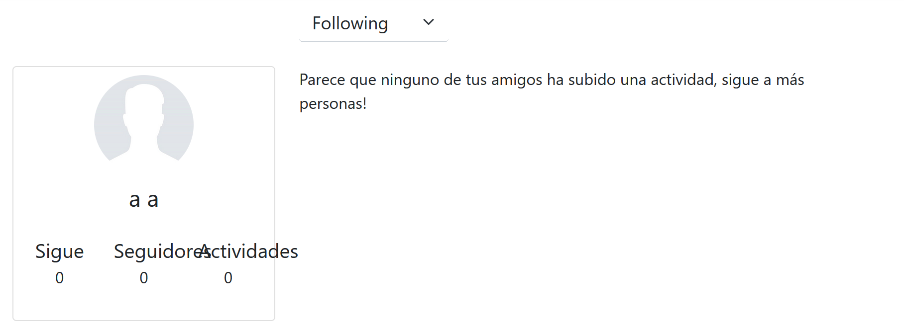

---
title:
  Instituto Tecnológico de Costa Rica\endgraf\bigskip \endgraf\bigskip\bigskip\
  StraviaTEC Manual de Usuario \endgraf\bigskip\bigskip\bigskip\bigskip
author:
  - José Morales Vargas, carné 2019024270
  - Alejandro Soto Chacón, carné 2019008164
  - Ignacio Vargas Campos, carné 2019053776
  - José Retana Corrales, carné 2020144743
date: \bigskip\bigskip\bigskip\bigskip Área Académica de\endgraf Ingeniería en Computadores \endgraf\bigskip\bigskip\ Bases de Datos \endgraf  (CE3101) \endgraf\bigskip\bigskip Profesor Marco Rivera Meneses \endgraf\vfill  Semestre I 2022
header-includes:
  - \setlength\parindent{24pt}
  - \usepackage{url}
  - \usepackage{float}
  - \floatplacement{figure}{H}
lang: es-ES
papersize: letter
classoption: fleqn
geometry: margin=1in
fontsize: 12pt
fontfamily: sans
linestretch: 1.5
...

\maketitle
\thispagestyle{empty}
\clearpage
\tableofcontents
\pagenumbering{roman}
\clearpage
\pagenumbering{arabic}
\setcounter{page}{1}

# Servicio Web 


# App Web

## Vista Deportista

### Crear cuenta

Al entrar a la página de Login se puede encontrar con el botón para registrarse al sistema, haciendo click en "Regístrese aquí". 

{height=50%}

Una vez hecho esto, se puede detallar la información del usuario, como el nombre de usuario, nombres y apellidos, fecha de nacimiento, nacionalidad y la contraseña. 

{height=50%}

Una vez rellenados los campos, se podrá hacer click en el botón "Registrar" para que quede el usuario en el sistema.
### Log In

Haciendo click en el botón del "Login" del Navbar superior, se puede ingresar a la página de Log In, donde se puede ingresar el nombre de usuario y la respectiva contraseña, para así meterse al sistema, ya sea en la vista de deportista o en la de organizador, dependiendo del las credenciales de la cuenta ingresada

{height=50%}
### Página de Inicio

Una vez registrada una cuenta y luego de meterse al sistema con esta, aparecerá la página principal de inicio, donde se puede ver a la izquierda la zona donde se encuentra el nombre del usuario y la foto seleccionada, junto con la cantidad de seguidores, la cantidad de personas que sigue y la cantidad de actividades registradas.

Del lado izquierdo se puede encontrar el feed de actividades, donde se puede filtrar por las actividades de los usuarios que uno está siguiendo o para que solo se muestren las actividades registradas por el usuario del perfil.

{height=50%}

### Búsqueda y seguimiento de atletas

Estando ingresado al sistema, se puede hacer click en "Buscar Usuarios" en la barra del Navbar superior, el cual lo llevará a la pantalla de búsqueda de Atletas, donde se puede ingresar el nombre del atleta en el espacio indicado, donde se puede hacer click en el botón de "Buscar" para que aparezca en la tabla inferior los usuarios encontrados. En esta tabla aparece el nombre de usuario, el nombre completo del usuario, la nacionalidad y la edad. Así como un botón verde para seguir al usuario en la parte derecha, o un botón rojo si ya lo sigue, para así dejar de seguirlo.

{height=50%}

### Registrar Actividad

Haciendo click en "Registrar actividad" en el Navbar superior, se ingresa a la página de registro de Actividades. En esta página se encuentra las opciones para que se seleccione el archivo .gpx de la actividad realizada, así como la fecha y hora de inicio y finalización de la actividad, el tipo de actividad realizado, el kilometraje, y si esta actividad es parte de una carrera o reto. Si esta actividad es una carrera o búsqueda, se le proporciona al usuario un espacio para que se busque dicho reto o carrera. Al lado derecho aparecerá en el mapa la actividad realizada según el archivo .gpx ingresado.

{height=50%}

### Comentar Actividades

Para cada actividad realizada que se observa en el feed de la pantalla principal, se pueden dejar comentarios haciendo clickmen el botón de la burbuja de diálogo. Una vez hecho click, se le indica el espacio para escribir el comentario y el respectivo botón para enviarlo

{height=50%}


### Inscribirse en una Carrera

Haciendo click en "Carreras" en el Navbar superior, se ingresa a la página de registro y búsqueda de carreras. En esta página se puede encontar el espacio destinado para introducir el nombre a buscar de la carrera, para luego hacer click en el botón de "Buscar" y que aparezca en la tabla inferior todas las carreras que calzan con el nombre indicado. Para cada una de estas se muestra en la tabla el nombre, la fecha de finalización, el precio, el tipo de deporte, las categorías y el respectivo botón para incripción.

{height=50%}

Si se hace click en el botón de registrarse, se le mostrará una ventana que le permitirá subir el archivo .pdf del recibo de pago, para luego hacer click en el botón verde para registrarse efectivamente en la carrera, si es que se cumplen los requisitos de categoría para el usuario.

{height=50%}

### Inscribirse en un Reto

Haciendo click en "Retos" en el Navbar superior, se ingresa a la página de registro y búsqueda de Retos. En esta página se puede encontar el espacio destinado para introducir el nombre a buscar del Reto respectivo, para luego hacer click en el botón de "Buscar" y que aparezca en la tabla inferior todos los Retos que calzan con el nombre indicado. Para cada uno de estos se muestra en la tabla el nombre, la fecha de inicio y finalización, los días restantes, el tipo de deporte del reto y el respectivo botón, ya sea para inscribirse o salirse del reto, si ya está suscrito en el dado reto.

{height=50%}

### Asociarse a un Grupo

Haciendo click en "Grupos" en el Navbar superior, se ingresa a la página de asociación a grupos. En esta página se puede encontar el espacio destinado para introducir el nombre a buscar del grupo respectivo, para luego hacer click en el botón de "Buscar" y que aparezca en la tabla inferior todos los grupos que calzan con el nombre indicado. Para cada uno de estos se muestra en la tabla el nombre, el nombre del administrador junto con su nombre de usuario y fel respectivo botón para asociarse al grupo, o para salirse del grupo.

{height=50%}

### Ver retos y carrearas inscritos

Haciendo click en "Inscripciones" en el Navbar superior, se ingresa a la página para ver los retos o carreras inscritos. Dependiendo si se apreta el botón de carreras o retos, se va a perimtir buscar en el buscador se busque el tipo respectivo. Si se busca un reto, se verá en pantalla una tabla con la cantidad restante de distancia, así como la meta y la fecha límite para que este sea completado. En el caso que sea una carrera, se mostrará el leaderboard de todos los usuarios que participaron en la carrera, junto con el tiempo que tuvieron, la distancia y la fecha en que fue realizada la actividad.

{height=50%}

## Vista Organizador

### Gestión de Carrera

Estando ingresado al sistema como un organizador, se podrá hacer click en el menú de dropdown que se llama "Admin" en el NavBar, y de ahí se selecciona la opción de "Gestión Carreras". Una vez ingresada a la página de gestión de carreras, en el lado izquierdo se podrá registrar carreras, donde se le ingresa en los campos indicados el nombre, el archivo .gpx, la fecha, el tipo de actividad, las categorías disponibles, el precio, las cuentas bancarias y los patrocinadores. Haciendo click en el botón de "Registrar" se podrá registrar esta carrera para todos lo usuarios, a menos de que se hiciera tic en el campo de "Privado".

En el lado derecho de esta pantalla se puede ver la lista de carreras junto con toda la información pertinente a ellas, como su nombre, fecha, actividad y demás. Para cada una se le presentan dos botones, una para editar la carrera y otra para eliminarla.

{height=50%}

### Aceptar Inscripción

Estando ingresado al sistema como un organizador, se podrá hacer click en el menú de dropdown que se llama "Admin" en el NavBar, y de ahí se selecciona la opción de "Aceptar inscriptions". Una vez ingresada a la página de inscripciones, se podrán ver todos los usuario pendientes que se quieren unir a una carrera, donde aparecerá en la tabla en nombre de la carrera, la información de usuario como nombre de usuario, primer y segundo nombre, nacionalidad y demás, la opción de descargar la factura subida, así como los botones para aceptar o denegar la inscripción.

{height=50%}


### Gestión de Retos

Estando ingresado al sistema como un organizador, se podrá hacer click en el menú de dropdown que se llama "Admin" en el NavBar, y de ahí se selecciona la opción de "Gestión Retos". Una vez ingresada a la página de gestión de retos, en el lado izquierdo se podrán registrar estos, donde se le ingresa en los campos indicados el nombre, la fecha de inicio y de fin, el tipo de actividad y el objetivo. Haciendo click en el botón de "Registrar" se podrá registrar este reto para todos lo usuarios, a menos de que se hiciera tic en el campo de "Privado".

En el lado derecho de esta pantalla se puede ver la lista de retos junto con toda la información pertinente a estos, como su nombre, fechas y demás. Para cada una se le presentan dos botones, una para editar la reto y otra para eliminarla.

{height=50%}

### Gestión de Grupos

Estando ingresado al sistema como un organizador, se podrá hacer click en el menú de dropdown que se llama "Admin" en el NavBar, y de ahí se selecciona la opción de "Gestión Grupos". Una vez ingresada a la página de gestión de grupos, en el lado izquierdo se podrán registrar estos, donde se le ingresa en los campos indicados el nombre y el admin, con el cual se ahce una búsqueda de usuarios. Haciendo click en el botón de "Registrar" se podrá registrar este reto para todos lo usuarios.

En el lado derecho de esta pantalla se puede ver la lista de grupos junto con  su nombre, el del admin y el número de miembros. Para cada una se le presentan dos botones, una para editar el grupo y otra para eliminarla.

{height=50%}

### Reporte de Participantes por Carrera

### Reporte de Posiciones de Carrera


# App Móvil

## Notas previas 

Asegúrese de tener los servicios de localización activados y verifique que la aplicación tenga los permisos adecuados especificados en el manual de instalación. 

## Autenticación

Al abrir la aplicación se presenta una pantalla en la que se ingresan los datos de autenticación, se selecciona el modo de operación (Online u Offline) y se puede realizar algunas configuraciones adicionales:

{height=40%}

- Uso con conexión: Cada solicitud se coordinará con el la aplicación que administra el servidor. En cada operación la base de datos actualizará el "caché" de datos local que se utilizará en modo offline.

- Uso sin conexión: Cada solicitud en este modo quedará pendiente de sincronización, y será aplicada hasta un nuevo login en modo en línea o una sincronización sin login.

- Configuración de servidor: En caso de querer editar la dirección web en la que se espera se encuentre el servidor que provee los datos para la aplicación, puede darle click al botón de configuración de servidor y esto habilitará la caja de texto para ingresar la nueva dirección.

- Sincronización sin conexión: Algunas operaciones puede ser conflictivas si se realizan mientras se tiene una sesión activa, por lo cuál se habilita la posibilidad de sincronizar los datos sin necesidad de loggearse en la aplicación.

Una vez autenticado el usuario, se mostrará el menú principal:

## Creación de actividades

Primeramente a tomar en cuenta, dado que no es requisito de la aplicación el poder crear una variedad distinta de tipos de actividades, se crean por defecto solo actividades de ciclismo que no están ligadas a un reto o carrera. 

### Muestra de datos de la actividad

En la pantalla de creación de actividades, tal como se muestra en la figura \ref{actividad0}, se observan los siguientes indicadores: 

- Tiempo desde que inició la actividad
- Kilómetros recorridos
- Velocidad promedio de la actividad
- Posición actual (punto azul)

{height=40%}

### Almacenamiento de la ruta gps

La aplicación hace uso del API de Google Play Services para obtener puntos de la ruta recorrida. Para trazar la ruta de la actividad, tal como se muestra en la figura \ref{actividad0}, se hace uso de los servicios de google maps. 

{height=40%}

Internamente, la aplicación va guardando una lista de puntos dados por los servicios de localización y una vez que el usuario decide terminar la actividad, esta lista es utilizada para generar un texto con formato `gpx` de la ruta. 

```XML

<?xml version="1.0" encoding="utf-8"?>
<gpx 
  xmlns="http://www.topografix.com/GPX/1/1" 
  xmlns:xsi="http://www.w3.org/2001/XMLSchema-instance" 
  creator="StraviaTEC 0.1.0" version="1.1" 
  xsi:schemaLocation="http://www.topografix.com/GPX/1/1 
  http://www.topografix.com/GPX/1/1/gpx.xsd">
  <trk>
    <name>route</name>
    <trkseg>
      <trkpt lat="9.9400729" lon="-84.095868">
        <time>2022-05-30T03:28:17Z</time>
      </trkpt>
      <trkpt lat="9.9400484" lon="-84.0958334">
        <time>2022-05-30T03:29:21Z</time>
      </trkpt>
      <trkpt lat="9.9400534" lon="-84.0958432">
        <time>2022-05-30T03:29:22Z</time>
      </trkpt>
    </trkseg>
  </trk>
</gpx>
```

En una sesión sin conexión, el texto de la ruta se guardará en la base de datos local junto con la información necesaria de la actividad para registrarla posteriormente en el proceso de sincronización. 

En una sesión con conexión, inmediatamente se realizará la consulta al servicio web de StraviaTEC para registrar la actividad con su ruta correspondiente

### Proceso de sincronización

Varios usuarios se pudieron haber conectado a la aplicación sin una conexión, y puede que cada uno haya registrado diversas actividades durante este tiempo. Es por esto que internamente la aplicación dispone de un base de datos que guarda las actividades con la información de usuario empotrada, tal como se muestra en la figura \ref{movil_datos0}.


La sincronización puede ocurrir de dos maneras:

- Sincronización automática: Cuando el usuario inicia sesión en una sesión en línea, automáticamente la aplicación tratará de ejecutar la rutina de sincronización

- Sincronización sin inicio de sesión: Tal como se muestra en la figura \ref{movil_login}, se dispone de un botón con la etiqueta de "Sync" que permite realizar una operación de sincronización sin necesidad de iniciar sesión. 
