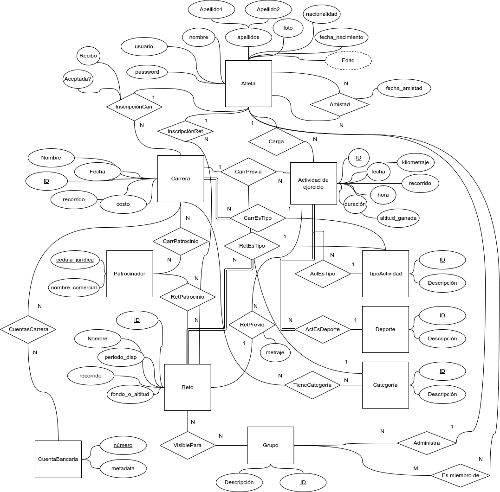
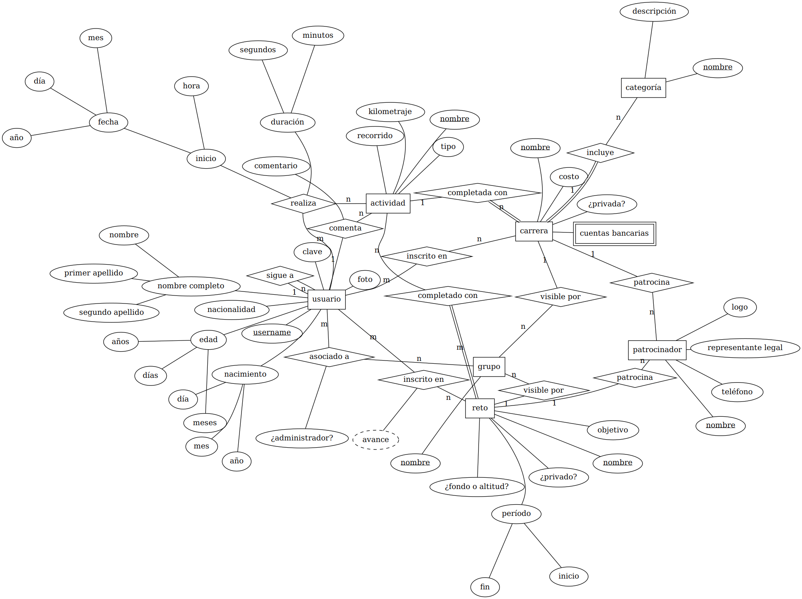
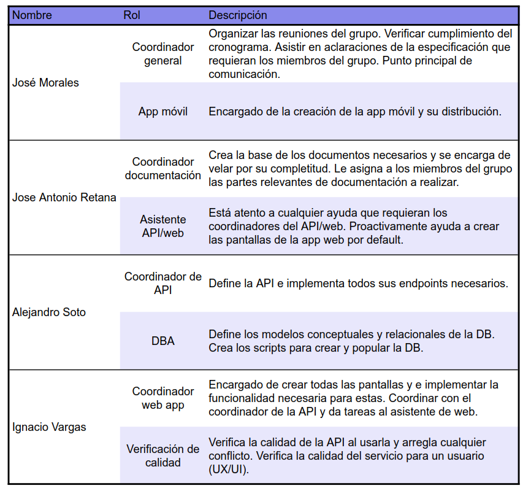
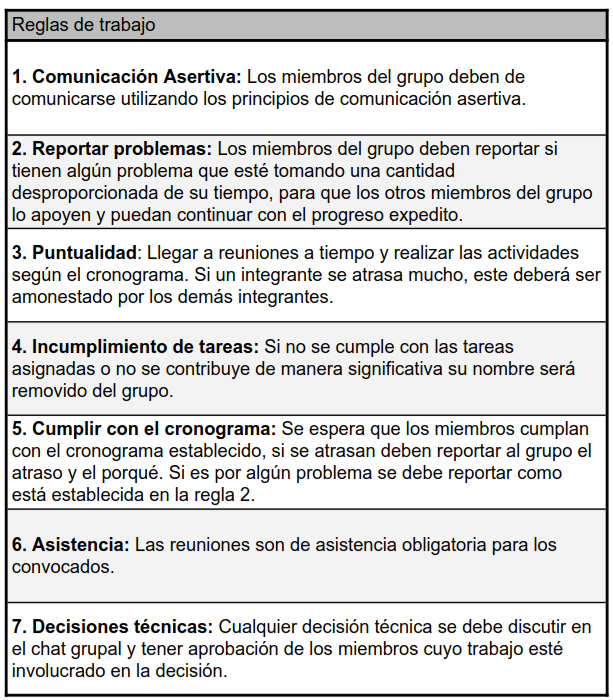
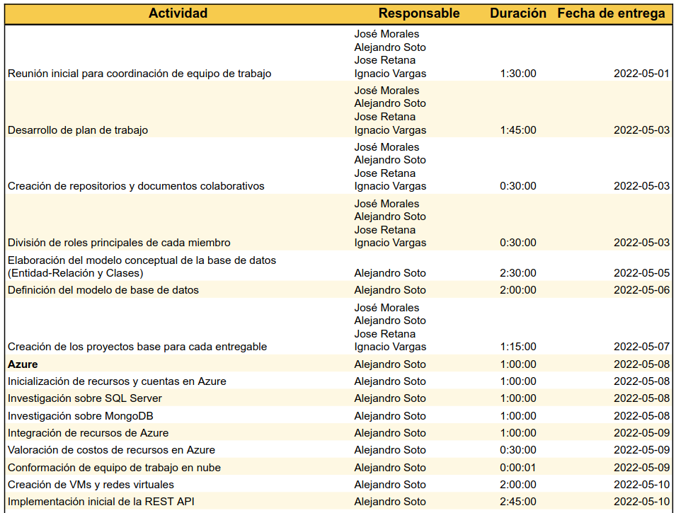
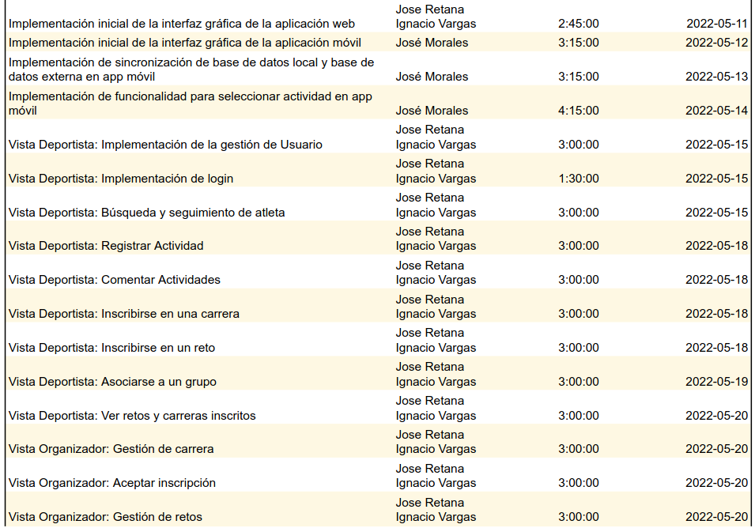
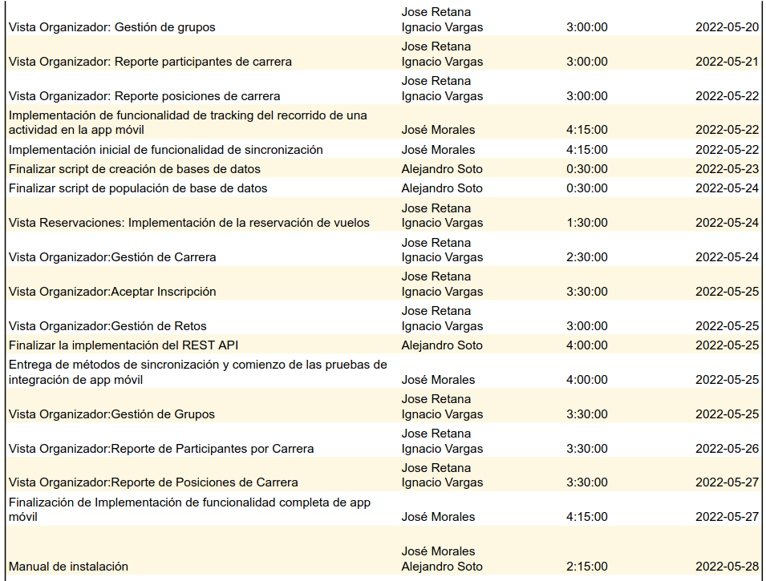
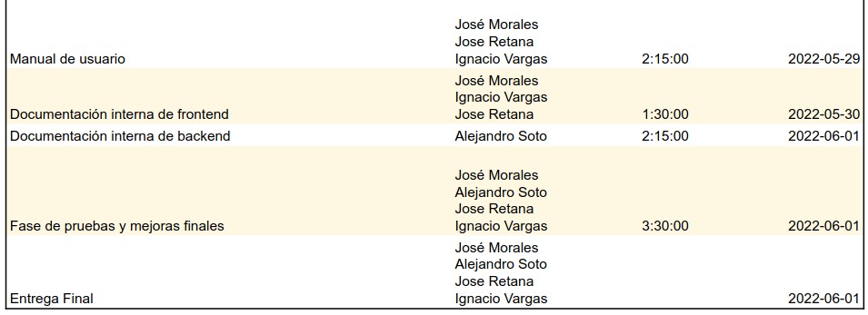
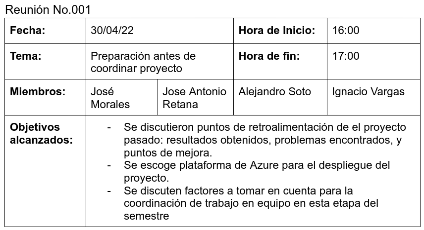
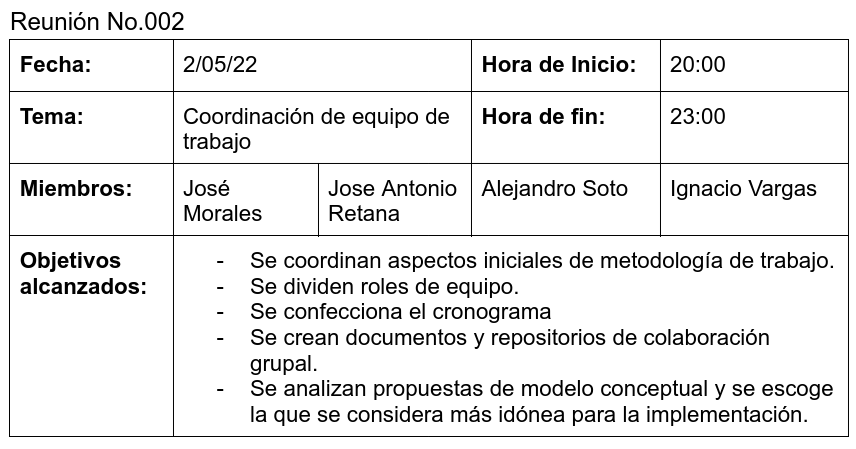

---
title:
  Instituto Tecnológico de Costa Rica\endgraf\bigskip \endgraf\bigskip\bigskip\
  StraviaTec Plan de Proyecto \endgraf\bigskip\bigskip\bigskip\bigskip
author:
  - José Morales Vargas, carné 2019024270
  - Alejandro Soto Chacón, carné 2019008164
  - Ignacio Vargas Campos, carné 2019053776
  - José Retana Corrales, carné 2020144743
date: \bigskip\bigskip\bigskip\bigskip Área Académica de\endgraf Ingeniería en Computadores \endgraf\bigskip\bigskip\ Bases de Datos \endgraf  (CE3101) \endgraf\bigskip\bigskip Profesor Marco Rivera Meneses \endgraf\vfill  Semestre I 2022
header-includes:
  - \setlength\parindent{24pt}
  - \usepackage{url}
  - \usepackage{float}
  - \floatplacement{figure}{H}
lang: es-ES
papersize: letter
classoption: fleqn
geometry: margin=1in
fontsize: 12pt
fontfamily: sans
linestretch: 1.5
bibliography: bibliografia.bib
csl: /home/josfemova/UsefulRepos/styles/ieee.csl
nocite: |
...

\maketitle
\thispagestyle{empty}
\clearpage
\tableofcontents
\pagenumbering{roman}
\clearpage
\pagenumbering{arabic}
\setcounter{page}{1}

# Introducción

Este proyecto consiste en desarrollar una aplicación web, junto a una aplicación móvil, que ofrece a sus usuarios deportistas una opción para que lleven un registro de todas sus actividades que les permita desde compartir sus sesiones hasta mejorar sus tiempos y entrenamientos.
Contará con una vista deportista, para los usuarios comunes, donde se le permitirá a los deportistas las siguientes actividades: visualizar de forma agradable/amigable las sesiones realizadas, buscar y seguir a otros atletas para observar su actividad, inscribirse en carreras, inscribirse en retos, crear y asociarse a grupos.
También contará con una vista organizador donde se podrán realizar las siguientes acciones: gestionar carreras, gestionar retos, gestionar grupos, generar reportes de los participantes de una carrera y de las posiciones finales.
En la aplicación móvil los deportistas podrán registrar actividades, mostrar el tiempo y distancia que han recorrido en una actividad, almacenar la ruta gps por la que transita el deportista. Esta app además contará con un mecanismo de sincronización de datos con la base de datos del servidor y guardará los datos en una base de datos empotrada de SQLite.
Para el servidor se utilizará para motor de bases de datos SQL Server y también MongoDB. Para la aplicación móvil se utilizará Android Studio y el lenguaje Kotlin. En la aplicación móvil se utilizará el framework de Angular, para los componentes se utilizará Bootstrap.
Además, se desplegará la aplicación en la nube utilizando Azure-AWS.

# Análisis de problema

## Propuesta de modelo conceptual 1

$$~~~~~$$

## Propuesta de modelo conceptual 2

$$~~~~~$$

## Justificación de escogencia

Lorem ipsum

# Trabajo individual y en equipo

## Metas de proyecto 

### 1. Desarrollo de la Base de Datos en SQLServer y MongoDB

Alejandro Soto desarrollará la Base de Datos en SQLServer y MongoDB (comentarios) definiendo el modelo de la base de datos (conceptual y relacional) , haciendo la investigación necesaria sobre SQLServer y MongoDB, creando el script de creación y populación de la base de datos.

- Criterio de entrega: Base de Datos 100% funcional según las especificaciones determinadas.

- Fecha estimada de entrega: Mayo 24, 2022

### 2. Desarrollo del servicio API 

Alejandro Soto desarrollará el servicio API, haciendo la investigación necesaria e implementando el REST API.

- Criterio de entrega: Servicio del REST API 100% funcional según las especificaciones determinadas.

- Fecha estimada de entrega: Mayo 24, 2022

### 3. Crear app web para deportistas (Vista Deportista): 

Jose Retana e Ignacio Vargas desarrollarán la vista para deportistas de la app web.

- Criterio de entrega: Desarrollo 100% completado de la app web cliente según las especificaciones determinadas (Crear Cuenta, Carga Inicial de Datos migrados de Stravia Version Beta, Log In, Página de inicio, Búsqueda y seguimiento de atletas, Registrar Actividad, Comentar actividades, Inscribirse en una Carrera, Inscribirse en un Reto, Asociarse a Grupo, Ver retos y carreras inscritos).

- Fecha estimada de entrega: Mayo 20, 2022

### 4. Crear app web para organizadores (Vista Organizador): 

Jose Retana e Ignacio Vargas desarrollarán la vista para organizadores del app web.

- Criterio de entrega: Desarrollo 100% completado de la app web para funcionarios según las especificaciones determinadas (Gestión de Carrera, Aceptar Inscripción, Gestión de Retos, Gestión de Grupo, Reporte de Participantes por Carrera, Reporte de Posiciones de Carrera).

- Fecha estimada de entrega: Mayo 27, 2022

### 5. Crear app móvil para clientes (Vista Aeropuerto Móvil): 

José Morales desarrollará la app móvil, la cual tendrá la funcionalidad del registro de actividades de los deportistas y que los datos se almacenen en SQL lite para que se registren y sincronicem con la app web.

- Criterio de entrega: Desarrollo 100% completado de la app móvil y su conexión/sincronización con la base de datos principal.

- Fecha estimada de entrega: Mayo 27, 2022

## Roles y Reglas

$$~~~~~$$

## Cronograma

$$~~~~~$$

## Minutas de sesiones de trabajo

$$~~~~~$$

## Bitácora

### Alejandro Soto

### José Morales

- 27 ABR
    + El profesor asigna el proyecto. 
- 29 ABR
    + Realizo una investigación breve sobre la aplicación en la que se basa el proyecto, para hacerme una mejor idea de lo que se espera en la interfaz gráfica de la aplicación móvil
- 30 ABR
    + Confecciono mi propuesta para modelo conceptual del proyecto
    + El equipo se reúne para discutir experiencias de primer proyecto y para coordinar aspectos básicos para la ejecución del proyecto.
- 2 MAY
    + El equipo se reúne para coordinar aspectos de trabajo en equipo tal como división de reglas, roles de trabajos y definición de cronograma.
    + Se crean repositorio y archivos de colaboración grupal.
    + Se analizan propuestas de modelo conceptual y se escoge una para su implementación
- 3 MAY
    + Se transcriben secciones de introducciones y metas de proyecto.
- 4 MAY
    + Se transcribe justificación de la escogencia de modelo conceptual para la implementación de proyecto.
- 5 MAY 
    + Se crea el proyecto base para el desarrollo de la app móvil.

### Jose Retana

- 27 de abril
    + Es asignado en clase el segundo proyecto
- 28 de abril
    + Se revisa el modelo conceptual creado para el examen, y se compara cpn la versión nueva del proyecto, para así agregarle y modificarle las entidades y relaciones para que sean juzgadas por los demás en futuro.
- 30 de abril
    + Se realiza una reunión grupal donde se discute principalmente los problemas y errores cometidos en el proyecto pasado, especialmente con respecto al manejo de tiempo y a la división de trabajo, esto para así idear nuevos métodos que ayuden a mejorar la experiencia y calidad del segundo proyecto.
- 31 de abril
    + Se termina la propuesta de modelo conceptual basada en la creada del examen. 
- 2 de mayo
    + Se realiza una segunda reunión de equipo para empezar con la creación del trabajo escrito del anexo/plan de proyecto, como el cronograma de actividades, los roles y las reglas.
    + Se revisan los modelos conceptuales de cada uno, de los cuales se escogieron los dos mejores para compararlos en el anexo (el de Alejandro y el de José Morales).
    + Se divide el resto de las partes del anexo, de tal forma que a mí me toca establecer las metas y la parte del aprendizaje continuo, según lo conversado en la reunión con los demás.
- 3 de mayo
    + Se crean las metas de proyecto según la metodología dada por el profesor para el proyecto anterior y se incluyen en el archivo.
- 5 de mayo 
    + Se desarrolla la parte de aprendizaje continuo del anexo, donde se expone los conocimientos actuales de los integrantes, lo que se requiere aprender para llevar a cabo el proyecto, y por último la estrategia utilizada para obtener dichos conocimientos y habilidades.

### Ignacio vargas

- 29/04/2022
    + Se toma una hora para leer y analizar la especificación del proyecto y formular posibles dudas al respecto.
- 30/04/2022
    + Reunión grupal para organización inicial del proyecto. Se escoge Azure para el despliegue del proyecto. Se discute la organización y rendimiento del proyecto pasado y cómo mejorar en este siguiente proyecto.
- 02/05/2022
    + Se coordina el plan de proyecto, cronograma, roles. Se crean documentos y repositorios de colaboración. Se escoge el modelo conceptual a utilizar en la DB.
- 06/05/2022
    + Se inicializó el proyecto para la aplicación web y se creó bastante del código boilerplate que ocupará la aplicación más tarde para el funcionamiento del login y las diferentes vistas.

# Aprendizaje continuo

## Conocimiento Actual:

- Se logran aplicar los conceptos y habilidades necesarias para crear y aplicar los modelos conceptuales y relacionales vistos en clase, así como el mapeo del modelo conceptual al relacional.
- El equipo es capaz de crear una base de datos en Postgresql para el almacenamiento y relación de datos.
- Se sabe crear un servicio API para que las apps web y móvil puedan obtener información de la base de datos de SQL, ya sea utilizando o no el Entity framework.
- Se conoce la forma de crear aplicaciones web utilizando las herramientas de Angular, HTML5, Bootstrap y CSS, de tal manera que se logre obtener información clave a través del API de la base de datos, y que se utilice la información para que esta aparezca en tablas, carruseles, listas y PDFs (utilizando herramientas para generación de este tipo de reportes)
- Se sabe cómo crear una app móvil utilizando Android Studio, así como se sabe utilizar SQL Lite para crear bases de datos empotrados en este, para que este se pueda sincronizar con la base de datos principal.

## Conocimiento a Adquirir:

## Estrategias de aprendizaje:
