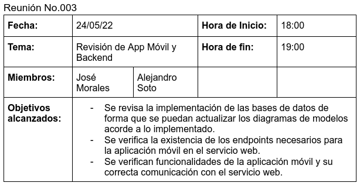
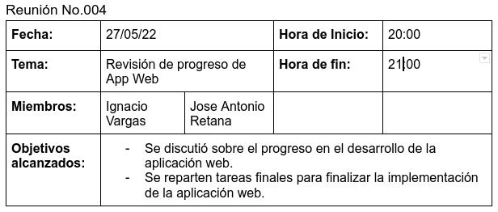
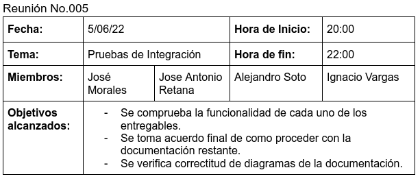

---
title:
  Instituto Tecnológico de Costa Rica\endgraf\bigskip \endgraf\bigskip\bigskip\
  StraviaTec Plan de Proyecto \endgraf\bigskip\bigskip\bigskip\bigskip
author:
  - José Morales Vargas, carné 2019024270
  - Alejandro Soto Chacón, carné 2019008164
  - Ignacio Vargas Campos, carné 2019053776
  - José Retana Corrales, carné 2020144743
date: \bigskip\bigskip\bigskip\bigskip Área Académica de\endgraf Ingeniería en Computadores \endgraf\bigskip\bigskip\ Bases de Datos \endgraf  (CE3101) \endgraf\bigskip\bigskip Profesor Marco Rivera Meneses \endgraf\vfill  Semestre I 2022
header-includes:
  - \setlength\parindent{24pt}
  - \usepackage{url}
  - \usepackage{float}
  - \floatplacement{figure}{H}
lang: es-ES
papersize: letter
classoption: fleqn
geometry: margin=1in
fontsize: 12pt
fontfamily: sans
linestretch: 1.5
bibliography: bibliografia.bib
csl: /home/josfemova/UsefulRepos/styles/ieee.csl
nocite: |
...

\maketitle
\thispagestyle{empty}
\clearpage
\tableofcontents
\pagenumbering{roman}
\clearpage
\pagenumbering{arabic}
\setcounter{page}{1}

# Introducción

Este proyecto consiste en desarrollar una aplicación web, junto a una aplicación móvil, que ofrece a sus usuarios deportistas una opción para que lleven un registro de todas sus actividades que les permita desde compartir sus sesiones hasta mejorar sus tiempos y entrenamientos.
Contará con una vista deportista, para los usuarios comunes, donde se le permitirá a los deportistas las siguientes actividades: visualizar de forma agradable/amigable las sesiones realizadas, buscar y seguir a otros atletas para observar su actividad, inscribirse en carreras, inscribirse en retos, crear y asociarse a grupos.
También contará con una vista organizador donde se podrán realizar las siguientes acciones: gestionar carreras, gestionar retos, gestionar grupos, generar reportes de los participantes de una carrera y de las posiciones finales.
En la aplicación móvil los deportistas podrán registrar actividades, mostrar el tiempo y distancia que han recorrido en una actividad, almacenar la ruta gps por la que transita el deportista. Esta app además contará con un mecanismo de sincronización de datos con la base de datos del servidor y guardará los datos en una base de datos empotrada de SQLite.
Para el servidor se utilizará para motor de bases de datos SQL Server y también MongoDB. Para la aplicación móvil se utilizará Android Studio y el lenguaje Kotlin. En la aplicación móvil se utilizará el framework de Angular, para los componentes se utilizará Bootstrap.
Además, se desplegará la aplicación en la nube utilizando Azure-AWS.

\pagebreak

# Análisis de problema

## Propuesta de modelo conceptual 1

$$~~~~~$$

\pagebreak

## Propuesta de modelo conceptual 2

$$~~~~~$$

## Justificación de elección de modelo conceptual

Se escogió el modelo conceptual 2 porque aunque los modelos tienen muchas similitudes entre sí, se decidió que el segundo modelo era el idóneo principalmente porque nos pareció más sencillo y que se apega mejor al modelo de la aplicación a desarrollar. Otro motivo por el cual se prefirió es porque hay varios atributos que deben de ser multivalores que en el primer modelo no lo son y sí en el segundo, como por ejemplo los nombres completos y las fechas. Una tercera razón es que al parecer del grupo, faltan algunos atributos o relaciones importantes en el modelo 1, como por ejemplo un atributo para saber si una carrera es privada o no.

# Trabajo individual y en equipo

## Metas de proyecto 

### 1. Desarrollo de la Base de Datos en SQLServer y MongoDB

Alejandro Soto desarrollará la Base de Datos en SQLServer y MongoDB (comentarios) definiendo el modelo de la base de datos (conceptual y relacional) , haciendo la investigación necesaria sobre SQLServer y MongoDB, creando el script de creación y populación de la base de datos.

- Criterio de entrega: Base de Datos 100% funcional según las especificaciones determinadas.

- Fecha estimada de entrega: Mayo 24, 2022

### 2. Desarrollo del servicio API 

Alejandro Soto desarrollará el servicio API, haciendo la investigación necesaria e implementando el REST API.

- Criterio de entrega: Servicio del REST API 100% funcional según las especificaciones determinadas.

- Fecha estimada de entrega: Mayo 24, 2022

### 3. Crear app web para deportistas (Vista Deportista): 

Jose Retana e Ignacio Vargas desarrollarán la vista para deportistas de la app web.

- Criterio de entrega: Desarrollo 100% completado de la app web cliente según las especificaciones determinadas (Crear Cuenta, Carga Inicial de Datos migrados de Stravia Version Beta, Log In, Página de inicio, Búsqueda y seguimiento de atletas, Registrar Actividad, Comentar actividades, Inscribirse en una Carrera, Inscribirse en un Reto, Asociarse a Grupo, Ver retos y carreras inscritos).

- Fecha estimada de entrega: Mayo 20, 2022

### 4. Crear app web para organizadores (Vista Organizador): 

Jose Retana e Ignacio Vargas desarrollarán la vista para organizadores del app web.

- Criterio de entrega: Desarrollo 100% completado de la app web para funcionarios según las especificaciones determinadas (Gestión de Carrera, Aceptar Inscripción, Gestión de Retos, Gestión de Grupo, Reporte de Participantes por Carrera, Reporte de Posiciones de Carrera).

- Fecha estimada de entrega: Mayo 27, 2022

### 5. Crear app móvil para clientes (Vista Aeropuerto Móvil): 

José Morales desarrollará la app móvil, la cual tendrá la funcionalidad del registro de actividades de los deportistas y que los datos se almacenen en SQL lite para que se registren y sincronicen con la app web.

- Criterio de entrega: Desarrollo 100% completado de la app móvil y su conexión/sincronización con la base de datos principal.

- Fecha estimada de entrega: Mayo 27, 2022

\pagebreak

## Roles y Reglas

$$~~~~~$$

\pagebreak

## Cronograma

$$~~~~~$$

\pagebreak

## Minutas de sesiones de trabajo

$$~~~~~$$

\pagebreak

## Bitácoras

### Alejandro Soto

- 27 de abril: Se asigna el proyecto y se discuten observaciones iniciales. Se
  definen los primeros puntos del plan de proyecto. Creo la cuenta de Azure que
  utilizaremos para deployment en la nube, utilizando la suscripción de
  estudiante. Observo los servicios ("recursos") que Azure tiene disponibles.
  Creo una máquina virtual simple y una base de datos (con su servidor) de tipo
  Microsoft SQL Server.

  También consideré si se debe tener una máquina virtual aparte para la
  instancia de Mongo o no. De momento parece que sí, ya que el recurso "Cosmos
  DB" no es Mongo exactamente, sino solo compatible con ello.

- 29 de abril: Creo una cuenta de MongoDB Atlas. Luego de un rato me doy cuenta
  de que, aunque se aloja en Azure, esto no es realmente lo que buscamos, ya
  que Atlas no es controlado ni desplegado desde Azure. Además, implica un
  costo adicional que no podemos presupuestar.

  Solicito los correos `@estudiantec.cr` de mis compañeros de equip para
  agregarlos al grupo de recursos que creé el pasado 27 de abril. Ellos lo
  hacen y acceden a Azure, con lo cual ya todos podemos observar y manipular
  los recursos del proyecto.

  Noto que, en las últimas 48 horas, se han consumido ~$12 de los $100
  disponibles en las cuentas para estudiantes. Esto es inaceptable, por lo que
  investigo y encuentro que esto se debe a una configuración predeterminada del
  servidor de base de datos que creé entonces. Específicamente, el tamaño de
  nodo (una métrica de CPU y RAM para la máquina virtual compartida que hostea
  el servidor) era demasiado alto y no se considera dentro de los recursos de
  consumo gratuito. Luego de arreglar esto me comprometo a revisar el consumo
  de budget con más regularidad.

- 30 de abril: Tras encontrar más características costosas que se activan por
  defecto, reduje el costo estimado a $5 por mes, lo cual ya es aceptable.

  Creo un recurso simple de app web, accesible desde
  <https://straviatec.azurewebsites.net>. En el repositorio agrego una
  plantilla para aplicaciones ASP.NET en C# con uso de frontend en Angular,
  justamente lo necesario para este proyecto. Le comento a mis compañeros sobre
  esto. Además, creo una regla de CI/CD en GitHub Workflows para que el
  deployment de esta última parte se realice automáticamente al hacer push a la
  rama de deployment.

  Luego de varias horas de estudiar la situación necesaria para la parte de
  SSIS que requiere la especificación, encuentro que esta es una característica
  destinada a fines empresariales y resulta imposible reducir su costo. Tras
  verificar este hecho, lo cual tomó mucho tiempo por sí solo debido a la poca
  documentación preemptiva, le comunico este hecho al profesor, explicando la
  distribución particular de recursos de Azure que lleva a esta situación. El
  profesor me indica que estudiará el problema.

  Encuentro que las máquinas virtuales gratuitas dentro de la suscripción para
  estudiantes son las B1S, pero este tipo de máquinas solo están disponibles en
  Australia por alguna razón. Encontrar este hecho también tomó una cantidad
  importante de tiempo ya que no está documentado. Parece ser (según un hilo de
  foro de abril) que Azure recientemente ha agotado la disponibilidad para
  máquinas gratuitas en Estados Unidos.

  Adicional a lo que ya escribí sobre SSIS, resulta ser que hay que crear un
  tipo de recurso llamado "data factory" e instalar el Studio respectivo solo
  para crear un paquete que luego sería importado en la ADF. Esto también tiene
  un costo.  Decidimos no tomarlo y comentarlo también al profesor. Además, no
  hubiera resultado en exactamente el mismo flujo de trabajo que SSIS
  on-premise. El profesor referenció un blog post, el cual comenta sobre el
  montado de SSIS, al final de la especificación. No obstante, esto es para SQL
  Server on-premise y no es útil para la situación actual. Encontramos una
  tabla en la documentación de Microsoft que describe las diferencias con
  respecto a SSIS entre bases de datos manejadas por Azure y SQL Server
  on-premise.

  El mismo truco de pasar de Estados Unidos a Australia no sirvió para mejorar
  los costos de ADF como sí ocurrió con máquinas virtuales.

- 2 de mayo: Durante una porción de la defensa del proyecto anterior, el
  profesor nos comenta que probablemente se descartará la parte de SSIS de la
  especificación debido a los comentarios resaltados.

- 3 de mayo: Nos reunimos en grupo para realizar el anexo. Terminamos el plan
  de proyecto y documentación administrativa relacionada.

- 4 de mayo: El profesor confirma en clase que SSIS se eliminará del proyecto.
  Realizo una propuesta de diagrama conceptual para el anexo.

- 15 de mayo: Trato de crear una vnet para la API y las bases de datos, pero
  resulta ser que esto requiere un tier de App Service que está fuera del
  presupuesto. Por tanto, escojo comunicación por direcciones públicas
  utilizando reglas de firewall que solo permitan acceso a las direcciones
  salientes del App Service.

  Encuentro que la B1s gratuita es insostenible en términos de rendimiento,
  por lo que la actualizo a B2s (~$40/mes, suficiente de aquí a la defensa).

- 20 de mayo: Escribo stubs para aproximadamente mitad de los endpoints que
  serán necesarios. Estos endpoints retornan valores hard-coded de momento.

- 21 de mayo: Escribo el resto de stubs. La API web está tentativamente lista
  en diseño para este punto y sigue implementarla propiamente. Informo a mis
  compañeros de equipo que pueden iniciar a conectar los demás componentes de
  la solución con la API. Este trabajo termina lo iniciado el día anterior.
  Duurante estos dos días, investigué varios detalles misceláneos sobre APIs
  web en ASP.NET Core, principalmente en documentación oficial de Microsoft.

  Agrego una connection string en la configuración del App Service. Esto
  permitirá iniciar la interacción entre el App Service y el Azure SQL Server
  que creé hace un tiempo.

  Agrego código para hacer dependency injection de la conexión a la base de
  datos SQL. Verifico que puedo extraer la connection string a partir del
  entorno de dotnet core.

  Empaqueté mssql-tools (cliente propietario para SQL Server) para el manejador
  de paquetes Nix que utilizo. Sin esto no hubiera sido posible usar la
  herramienta fuera de Windows, Mac, Ubuntu, SUSE o Red Hat. Nix es universal,
  así que esto mismo funciona en cualquier otro sistema Linux donde se haya
  instalado Nix.

- 23 de mayo: Implementé una abstracción por inyección de dependencias para
  manejar automáticamente las conexiones a la base de datos sin repetir mucho
  código, así como el proceso de creación, envío y tratamiento de respuestas de
  solicitud.

  Implemento login y fotos de usuario. Agrego un usuario organizador
  predeterminado al script de populación.

### José Morales

- 27 ABR
    + El profesor asigna el proyecto. 
- 29 ABR
    + Realizo una investigación breve sobre la aplicación en la que se basa el 
    proyecto, para hacerme una mejor idea de lo que se espera en la interfaz 
    gráfica de la aplicación móvil
- 30 ABR
    + Confecciono mi propuesta para modelo conceptual del proyecto
    + El equipo se reúne para discutir experiencias de primer proyecto y para 
    coordinar aspectos básicos para la ejecución del proyecto.
- 2 MAY
    + El equipo se reúne para coordinar aspectos de trabajo en equipo tal como 
    división de reglas, roles de trabajos y definición de cronograma.
    + Se crean repositorio y archivos de colaboración grupal.
    + Se analizan propuestas de modelo conceptual y se escoge una para su 
    implementación
- 3 MAY
    + Se transcriben secciones de introducciones y metas de proyecto.
- 4 MAY
    + Se transcribe justificación de elección de modelo conceptual para la 
    implementación de proyecto.
- 5 MAY 
    + Se crea el proyecto base para el desarrollo de la app móvil.
- 10 MAY
    + Se investigó sobre el como se podía integrar los servicios de localización 
    en una aplicación móvil.
- 12 MAY
    + Se investigó sobre el formato gpx para decidir que información debía 
    registrar la aplicación móvil.
- 14 MAY
    + Se investigó sobre el uso de google maps para la muestra de localización
    en aplicaciones móviles para android.
- 16 MAY
    + Se agrega la mayor parte de funcionalidad de seguimiento de localización
    de usuario en la aplicación móvil. 
    + Se implementa la lógica de registro progresivo de datos que permite la
    generación de un archivo gpx.
    + Se realiza una implementación temprana de una función que genera un texto
    conforme a la especificación del formato gpx
- 20 MAY
    + Se realizan correcciones ortográficas en el código y comentarios de la 
    aplicación móvil.
    + Se remueven actividades y código no necesarios que se habían creado en 
    una etapa inicial del desarrollo. 
    + Se implementa la lógica de sincronización.
- 23 MAY
    + Se implenta la lógica de guardado de actividades en la base de datos
    empotrada de la aplicación móvil.
    + Se escribe la mayor parte de la documentación interna de la aplicación
    móvil.
- 29 MAY
    + Se realizan las primeras pruebas de integración, y en base a estas, se
    implentan correciones en la aplicación móvil para evitar comportamiento
    inconsistente. 
- 30 MAY
    + Se confecciona el diagrama de arquitectura final del sistema para motivos
    de documentación.
    + Se agregan nuevos diagramas de modelo conceptual y relacional que
    reflejan de mejor manera la implementación final del proyecto.
- 31 MAY
    + Se describe el proceso de mapeo de modelo conceptual a relacional en la 
    documentación técnica ejecutiva. 
- 1 JUN
    + Se documentan las estructuras de datos (tablas) implementadas en el
    proyecto.

### Jose Retana

- 27 de abril
    + Es asignado en clase el segundo proyecto
- 28 de abril
    + Se revisa el modelo conceptual creado para el examen, y se compara con la versión nueva del proyecto, para así agregarle y modificar las entidades y relaciones para que sean juzgadas por los demás en futuro.
- 30 de abril
    + Se realiza una reunión grupal donde se discute principalmente los problemas y errores cometidos en el proyecto pasado, especialmente con respecto al manejo de tiempo y a la división de trabajo, esto para así idear nuevos métodos que ayuden a mejorar la experiencia y calidad del segundo proyecto.
- 31 de abril
    + Se termina la propuesta de modelo conceptual basada en la creada del examen. 
- 2 de mayo
    + Se realiza una segunda reunión de equipo para empezar con la creación del trabajo escrito del anexo/plan de proyecto, como el cronograma de actividades, los roles y las reglas.
    + Se revisan los modelos conceptuales de cada uno, de los cuales se escogieron los dos mejores para compararlos en el anexo (el de Alejandro y el de José Morales).
    + Se divide el resto de las partes del anexo, de tal forma que a mí me toca establecer las metas y la parte del aprendizaje continuo, según lo conversado en la reunión con los demás.
- 3 de mayo
    + Se crean las metas de proyecto según la metodología dada por el profesor para el proyecto anterior y se incluyen en el archivo.
- 5 de mayo 
    + Se desarrolla la parte de aprendizaje continuo del anexo, donde se expone los conocimientos actuales de los integrantes, lo que se requiere aprender para llevar a cabo el proyecto, y por último la estrategia utilizada para obtener dichos conocimientos y habilidades.

### Ignacio vargas
- 16/05/2022
    + Se instalaron varias librerías básicas necesarias del proyecto y se empezó la creación de la arquitectura base de la página web.
- 21/05/2022
    + Se agregaron componentes del proyecto viejo y funciona el login
- 23/05/2022
    + Se creó y terminó el form para crear usuarios nuevos en el sistema.
- 23/05/2022
    + Se agregaron settings en el nav-menu. Se agregaron capacidades nuevas para el auth guard como poder expresar que todos los roles loggeados se permiten, o que solo se permite si no está loggeado. Se manejaron algunos errores con cómo se toma el URL del API. Se creó un estilo css "warning" para mostrar los mensajes de error. Ya se pueden crear usuarios nuevos en el sistema.
- 24/05/2022
    + Se agregó mucho manejo de errores para diversos códigos de error comunes por parte del API. Se agregó manejo de cookies para guardar la información de autenticación del usuario.
- 25/05/2022
    + Se arreglaron errores con el comportamiento de hacer logout. Se convirtieron los settings en un dropdown. El nav-menu ahora varía dependiendo de estado de autenticación.
- 26/05/2022
    + Se hizo un poco de setup para la funcionalidad de poder editar usuarios.
- 27/05/2022
    + Se agregó funcionalidad de registrar otros organizadores. Borrar propia cuenta. Editar perfil.
- 29/05/2022
    + Se arreglaron varios errores con el navbar y el form de registrar actividades. Se agregaron algunas cosas a este mismo form y se agregó el mapa para mostrar las rutas gpx.

- 30/05/2022
    + Se terminó la validación para registrar actividades y la duración se setea automáticamente basado en tiempos de inicio y fin. También se terminó de conectar el registro de actividades con el API.
- 31/05/2022
    + Se inició creando la página de gestión ed carreras y se cambiaron las interfaces de carreras para manejar correctamente las carreras enviadas por el API.
- 02/06/2022
    + Se creó la barra de búsqueda que será utilizada para los forms que se requiera escoger grupos/carrera/retos. Se terminó la funcionalidad de imágenes en los forms de registro pero se notó que no se está autenticado a la hora de registrar por lo que se removió. Se agregó categorías y cuentas bancarias + validación al form de gestionar carreras.
- 03/06/2022
    + Agregada funcionalidad de imágenes en form de registro, luego me di cuenta de los malavares que tendría que hacer para que funcione realmente (hacer login immediato, put imagen, logout) y quité todo lo relacionado con agregar imagen a la hora de registrar. Luego agregué funcionalidad de imágenes a form de editar usuarios, junto con validación de 4MB y círculo de cargar mientras cargan los datos. Se mejoró la forma que nav-menu obtiene los estados de autenticación y roles. Se agregó el componente de dashboard y se dejó funcionando en teoría, aunque no se puede comprobar porque al momento de escritura no se pueden seguir otros usuarios.

# Aprendizaje continuo

## Conocimiento Actual:

- Se logran aplicar los conceptos y habilidades necesarias para crear y aplicar los modelos conceptuales y relacionales vistos en clase, así como el mapeo del modelo conceptual al relacional.
- El equipo es capaz de crear una base de datos en PostgreSQL para el almacenamiento y relación de datos.
- Se sabe crear un servicio API para que las apps web y móvil puedan obtener información de la base de datos de SQL, ya sea utilizando o no el Entity framework.
- Se conoce la forma de crear aplicaciones web utilizando las herramientas de Angular, HTML5, Bootstrap y CSS, de tal manera que se logre obtener información clave a través del API de la base de datos, y que se utilice la información para que esta aparezca en tablas, carruseles, listas y PDFs (utilizando herramientas para generación de este tipo de reportes)
- Se sabe cómo crear una app móvil utilizando Android Studio, así como se sabe utilizar SQL Lite para crear bases de datos empotrados en este, para que este se pueda sincronizar con la base de datos principal.

## Conocimiento a Adquirir:

- Se requiere aprender a crear bases de datos en SQL Server y en MongoDB, para así poder almacenar los datos de StraviaTec, de tal manera de que se puedan mapear los datos de los modelos conceptuales y relacionales del proyecto.
- Se debe aprender a desarrollar toda la lógica de las bases de datos a implementar por medio de _store procedures_, _vistas_ y _triggers_
- Es necesario aprender a configurar un API para que las apps web y móvil puedan acezar a la información almacenada en la base de datos, esto tanto para SQL Server como para MongoDB.
- Se debe aprender a desplegar en la nube la capa de servicios utilizando Azure o Amazon Web Services (AWS)
- Para el desarrollo de la app móvil, será necesario aprender a cómo obtener la ubicación del usuario para guardar la ruta GPS por donde transita, de tal manera que este se almacene en un archivo .gpx y que este sea guardado en la base de datos.
- Para el app web, será necesario aprender a cómo desplegar el archivo .gpx para que se pueda mostrar los recorridos tomados por los deportistas en cada actividad o carrera.

## Estrategias de Aprendizaje:

- Utilizando los recursos disponibles en el internet (libros, páginas web, blogs, videos, páginas web de documentación oficial), por medio de auto-aprendizaje, se quiere aprender a utilizar los sistemas de gestión de bases de datos SQL Server y Mongo DB, así como la configuración de los servicios API de estos. De esta misma manera se espera aprender a desplegar los servicios por medio de Azure, así como la funcionalidad para el guardado y despliegue de las rutas en archivos .gpx para el app móvil y web respectivamente.
- Utilizar el conocimiento que será visto en clase, así como las presentaciones de estas para obtener las bases importantes para implementar la lógica de las bases de datos utilizando los _store procedures_, _vistas_ y _triggers_ (Procedimientos Almacenados). Una vez hecho esto, se puede investigar en internet sobre estos por separado y su implementación en los respectivos sistemas de SQL Server y MongoDB, para así poder empezar con el desarrollo del backend del proyecto.
- Se espera hacer siempre consulta con los demás compañeros de trabajo antes de empezar a investigar o desarrollar alguna parte crítica con la que no se tiene suficiente conocimiento previo, para así lograr agilizar el proceso aclarando dudas y dificultades iniciales que se puedan sobrepasar con explicaciones y consejos útiles.
- Si se encuentra alguna dificultad de un nivel muy alto, es posible realizar un aprendizaje colaborativo donde se realice una reunión grupal para escuchar opiniones y soluciones de los otros compañeros para así lograr llegar a alguna conclusión o camino viable para la solución de este problema, ya sea tomando un enfoque distinto sugerido por algún otro compañero o por algún descubrimiento realizado en conjunto sobre la naturaleza del problema.

